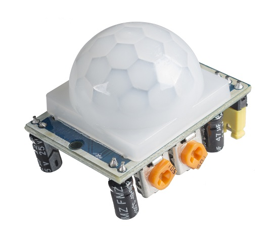

# ir-sensor-monitor

Python script used to read the state from an HC-SR501 Passive Infrared sensor

## Components

### HC-SR501 Sensor

### State monitor `ism.py` in Python

* Read states from the sensor;
* Notify downstream applications by calling their RESTful APIs;
* Log detection events to a SQLite database.

### Detection records visualizer `q-visualizer` in C++/Qt

* Read detection records from the SQLite database;
* plot a linechart in C++/Qt;
